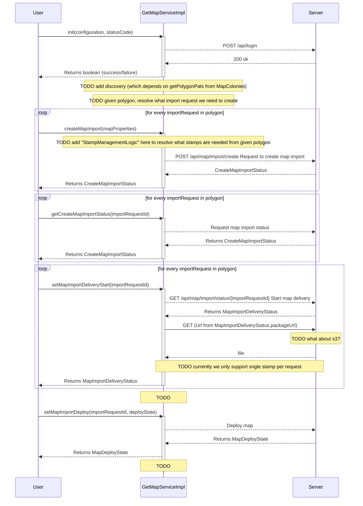

# GETAPP-ANDROID-SDK
GETAPP SDK is the api defined frm the application point of view.

## Getting started

Just compile and use accordingly:
- The api is in `sdk/build/outputs/aar` + `getAppClient/build/outputs/aar`

### API flow



# OpenApi code generator

Running:

```shell
docker run --rm -v "${PWD}:/local" openapitools/openapi-generator-cli generate -i http://getapp-dev.getapp.sh:3000/docs-yaml -g kotlin --additional-properties=packageName=GetApp.Client,packageVersion=1.0 -o /local/GetApp.Client.Kotlin
```

OR

```shell
docker run --rm -v "${PWD}:/local" openapitools/openapi-generator-cli generate -i local/docs-yaml -g kotlin --additional-properties=packageName=GetApp.Client,packageVersion=1.0 -o /local/GetApp.Client.Kotlin
```

In case owner is not $USER - change ownership of generated directory:

```shell
sudo chown -R $USER GetApp.Client.Kotlin/
```

For config options, see:
https://openapi-generator.tech/docs/generators/kotlin

## Add to SDK

copy-paste `kotlin` directory into `app/sdk/src/main`

# Documentation

To generate KDoc run: 

```cmd
gradlew dokkaHtml
```

https://kotlinlang.org/docs/dokka-gradle.html#single-project-builds

***

Emulator stopped to run from Android Studio from some reason...
Run same command Android Studio uses from terminal instead:

```shell
D:\DevTools\Android\Sdk\emulator\emulator.exe -netdelay none -netspeed full -avd Pixel_5_API_33 -qt-hide-window -grpc-use-token -idle-grpc-timeout 300
```

https://developer.android.com/studio/emulator_archive
