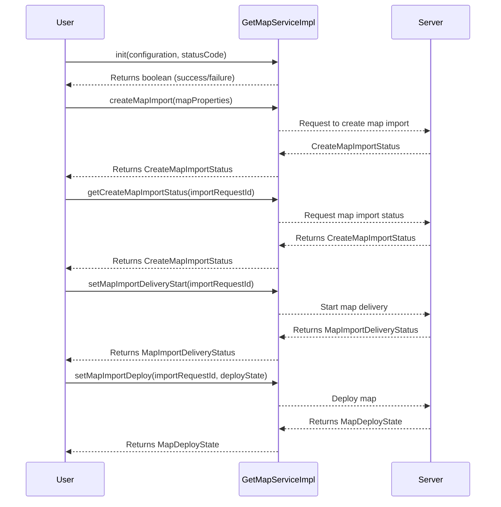

# GETAPP-ANDROID-SDK
GETAPP SDK is the api defined frm the application point of view.

## Getting started

Just compile and use accordingly:
- the api is in /app/sdk - provides a .aar output

### API flow

